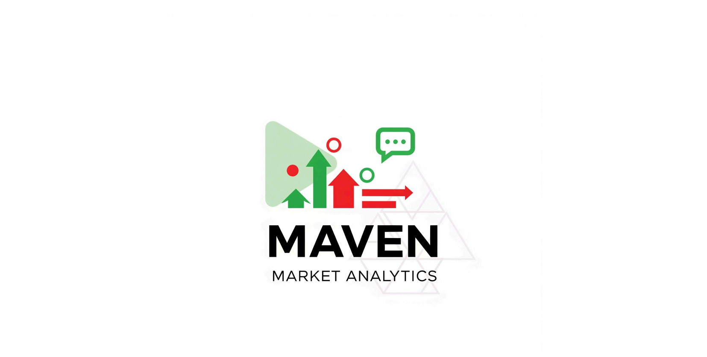

# 🍎 Maven Market Sales & Returns Dashboard

This Power BI dashboard provides a comprehensive overview of sales performance, product profitability, and return rates for the fictional "Maven Market." It is designed to help stakeholders make data-driven decisions by analyzing trends across time, geography, and product lines.

## 📊 Dashboard Features

* **Key Metrics:**

  * Total Quantity Sold
  * Number of Returns
  * Total Transactions
  * Monthly Revenue, Profit, and Return Goals

* **Product Insights:**

  * Gross revenue by product and brand
  * Return rates and profitability per brand
  * Top-performing and underperforming products

* **Time-Series Analysis:**

  * Gross revenue breakdown by year, quarter, and month

* **Geographic Filtering:**

  * Interactive country filters (USA, Canada, Mexico)

* **Customer Data Snapshot:**

  * Average income, children status, and product preference insights

## 📈 Business Recommendations

Based on the analysis:

* Increase stock of high-demand products like **Hermanos**, **Tri-State**, and **Tell Tale** during November and December.
* Prioritize inventory and marketing for **Canada**, which shows strong performance.
* Further evaluate **King** brand products for growth or optimization opportunities.

## 🛠️ Tools & Technologies Used

* **Power BI Desktop** – for data modeling, DAX measures, and visual design
* **Microsoft Excel** – for preprocessing and data exploration
* **Data Analysis Expressions (DAX)** – for custom KPIs and calculated columns
